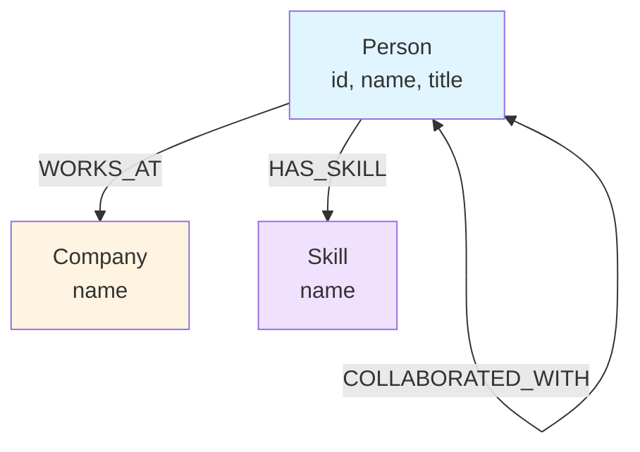

# Data Model Documentation

## Graph Schema

### Visual Representation

```
                    ┌─────────────────┐
                    │    Company      │
                    │                 │
                    │  - name         │
                    └────────┬────────┘
                             │
                             │ WORKS_AT
                             │
                    ┌────────▼────────┐
                    │     Person      │
                    │                 │
                    │  - id           │
                    │  - name         │
                    │  - title        │
                    └───────┬─────────┘
                            │
                            │ HAS_SKILL
                            │
                    ┌───────▼─────────┐
                    │     Skill       │
                    │                 │
                    │  - name         │
                    └─────────────────┘

    ┌─────────────┐                      ┌─────────────┐
    │   Person    │◄────────────────────►│   Person    │
    │             │ COLLABORATED_WITH    │             │
    └─────────────┘                      └─────────────┘
```

### Mermaid Diagram



## Node Types

### Person
Represents a professional in the network.

**Properties:**
- `id` (string, unique): Unique identifier (e.g., "p1", "p2")
- `name` (string): Full name of the person
- `title` (string): Job title or role

**Example:**
```cypher
(:Person {id: "p1", name: "Aisha Patel", title: "Product Lead"})
```

### Company
Represents an organization where people work.

**Properties:**
- `name` (string, unique): Company name

**Example:**
```cypher
(:Company {name: "NovaTech"})
```

### Skill
Represents a technical or professional capability.

**Properties:**
- `name` (string, unique): Skill name

**Example:**
```cypher
(:Skill {name: "Graph Databases"})
```

## Relationship Types

### WORKS_AT
Connects a Person to their current Company.

**Direction:** Person → Company
**Cardinality:** Many-to-One (a person works at one company, a company has many people)

**Example:**
```cypher
(:Person {id: "p1"})-[:WORKS_AT]->(:Company {name: "NovaTech"})
```

### HAS_SKILL
Connects a Person to a Skill they possess.

**Direction:** Person → Skill
**Cardinality:** Many-to-Many (a person has many skills, a skill is possessed by many people)

**Example:**
```cypher
(:Person {id: "p1"})-[:HAS_SKILL]->(:Skill {name: "Product Strategy"})
```

### COLLABORATED_WITH
Connects two People who have collaborated.

**Direction:** Bidirectional (undirected in practice)
**Cardinality:** Many-to-Many

**Example:**
```cypher
(:Person {id: "p1"})-[:COLLABORATED_WITH]-(:Person {id: "p2"})
```

## Constraints

The following constraints are created to ensure data integrity:

```cypher
CREATE CONSTRAINT unique_person_id IF NOT EXISTS ON (p:Person) ASSERT p.id IS UNIQUE;
CREATE CONSTRAINT unique_company_name IF NOT EXISTS ON (c:Company) ASSERT c.name IS UNIQUE;
CREATE CONSTRAINT unique_skill_name IF NOT EXISTS ON (s:Skill) ASSERT s.name IS UNIQUE;
```

## Sample Data

The seed data creates the following graph:

**People:**
- p1: Aisha Patel, Product Lead at NovaTech
- p2: Marcus Lee, Senior Backend Engineer at NovaTech
- p3: Priya Singh, Data Scientist at BrightEdge
- p4: Olivia Ramirez, Growth Marketing Manager at BrightEdge
- p5: Eric Chen, Technical Program Manager at Skyline Labs

**Companies:**
- NovaTech
- BrightEdge
- Skyline Labs

**Skills:**
- Product Strategy, AI Ethics, Stakeholder Management
- Java, Graph Databases, Distributed Systems
- Machine Learning, Graph Analytics, Python
- Performance Marketing, A/B Testing, Customer Retention
- Program Management, Cross-functional Leadership, AI Strategy

**Collaborations:**
- p1 ↔ p2 (Aisha collaborated with Marcus)
- p2 ↔ p3 (Marcus collaborated with Priya)
- p3 ↔ p5 (Priya collaborated with Eric)
- p4 ↔ p5 (Olivia collaborated with Eric)

## Query Patterns

### Find all skills of a person
```cypher
MATCH (p:Person {id: $personId})-[:HAS_SKILL]->(s:Skill)
RETURN s.name AS skill
```

### Find all people at a company
```cypher
MATCH (p:Person)-[:WORKS_AT]->(c:Company {name: $companyName})
RETURN p.name AS person
```

### Find common skills between two people
```cypher
MATCH (p1:Person {id: $id1})-[:HAS_SKILL]->(s:Skill)<-[:HAS_SKILL]-(p2:Person {id: $id2})
RETURN s.name AS commonSkill
```

### Find shortest path between two people
```cypher
MATCH path = shortestPath(
  (p1:Person {id: $fromId})-[*]-(p2:Person {id: $toId})
)
RETURN path
```

## Performance Considerations

### Indexes
Constraints automatically create indexes, ensuring:
- Fast lookups by Person ID
- Fast lookups by Company name
- Fast lookups by Skill name

### Query Optimization
- Use parameterized queries to enable query plan caching
- Limit result sets with `LIMIT` clause
- Use `OPTIONAL MATCH` for non-critical relationships
- Consider query hints for complex traversals

## Scalability

The current data model scales well for:
- **Thousands to hundreds of thousands of nodes**: Within free tier limits
- **Millions of relationships**: Efficient traversal with proper indexing
- **Complex multi-hop queries**: Graph databases excel at deep traversals

For larger datasets, consider:
- Sharding by company or geographic region
- Caching frequently accessed paths
- Read replicas for query scaling
